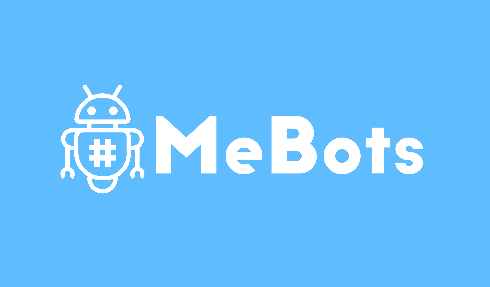
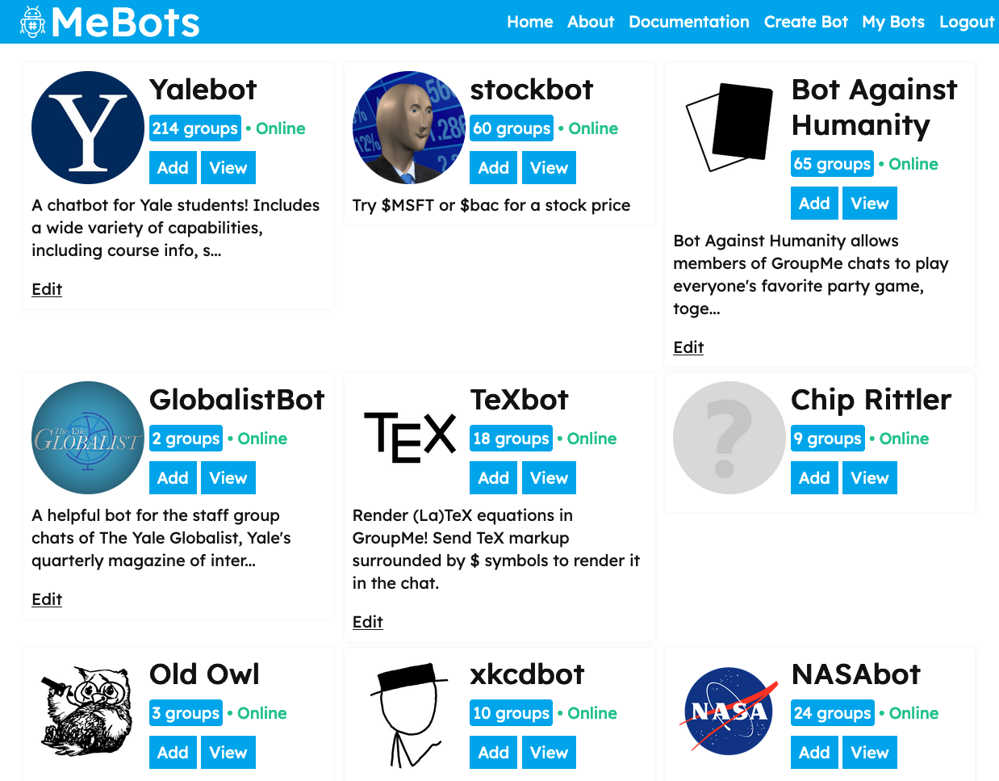

# [MeBots](https://mebots.io)

> The app store for GroupMe bots, with a simple API framework for managing bots at scale.

## Motivation
GroupMe's bot framework has no native support for third-party adding of bots to servers. Since GroupMe requires the creation of a bot within a single group and essentially mandates mapping group IDs to bot IDs in order for a bot to function across multiple servers, the only option for scalable and open adding of the bot without owner oversight was previously to roll your own database system and custom web interface to allow users to log in through the GroupMe API and use a user's token to add the bot, then store the bot's ID and recall it when receiving a message. This process is similar between different bots, which can result in a lot of nasty code reuse.

MeBots handles the entire bot lifecycle process and extends it beyond what GroupMe normally supports. Bot developers can provide basic details about their bot, and other users can find bots and easily add them to their own chats with just a few clicks. MeBots communicates with GroupMe's API behind the scenes to create different bot instances and store away relevant data. Then, when a bot receives a message, GroupMe injects bot authentication information into the message payload so your bot can easily know where to reply without any more hassle.

Read more about MeBots' goals and implementation [here](https://mebots.io/about), and read the documentation [here](https://mebots.io/documentation)!

## Author
[Erik Boesen](https://github.com/ErikBoesen)
